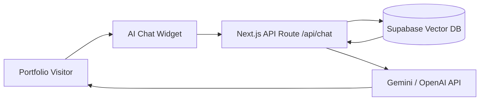

# 🚀 Future AI & LLM Integration Roadmap for Portfolio & Blog

This document outlines high-impact, futuristic **AI & LLM Model Integrations** you can add to your portfolio and blog to showcase your expertise as a **Fullstack & AI Engineer**.

---

## 💡 1. Interactive RAG Chatbot ("Ask AI About Harsh & My Blogs")

### 🎯 Overview
Add a floating AI assistant widget on your portfolio (`/`) and blog (`/blog`) that answers questions about your work, tech stack, resume, projects, and specific blog post contents.

### 🛠️ Architecture & Tech Stack
- **LLM Provider**: Gemini 1.5 Flash / OpenAI GPT-4o-mini (fast & low latency).
- **Vector DB / Retrieval**: Supabase Vector / Pinecone / ChromaDB.
- **Framework**: LangChain / Vercel AI SDK (`ai/react`).



### ✨ Value
Visitors and recruiters can ask: *"What experience does Harsh have with Next.js?"* or *"Summarize Harsh's article on system design"* and get immediate typed responses.

---

## ⚡ 2. AI "TL;DR" & Executive Summarizer Button

### 🎯 Overview
Add an **"AI Summarize"** button on blog detail pages (`/blog/[slug]`). When clicked, it generates a 3-bullet executive summary and key takeaways of the article in real time.

### 🛠️ Implementation Details
- **API Route**: `/api/summarize`
- **Cache Strategy**: Cache generated summaries in `localStorage` or KV store to avoid repeated LLM API calls.
- **UI**: Display an animated modal or callout box with a glowing AI badge.

---

## 🎧 3. AI Voice Article Reader (Text-to-Speech Narration)

### 🎯 Overview
Let readers listen to your technical articles on the go with natural-sounding AI voice narration.

### 🛠️ Integration Options
- **Option A**: ElevenLabs API for realistic human voice clones.
- **Option B**: OpenAI Audio (`tts-1`) for clean, crisp voice synthesis.
- **Option C**: Browser Native `window.speechSynthesis` (100% free with zero API costs).

---

## 🔎 4. AI Semantic Search & Smart Article Recommendations

### 🎯 Overview
Upgrade keyword searching to **Semantic Search**. Searching for *"how to make web apps faster"* will intelligently match articles about *Tailwind v4*, *CDN Edge Caching*, and *TanStack Query*, even if those exact words aren't in the search query.

### 🛠️ Implementation Details
- Embed article titles and summaries using `text-embedding-3-small` or Gemini Embeddings (`embedding-001`).
- Compute cosine similarity to recommend "Related AI & Tech Articles" at the bottom of each blog post.

---

## 💻 5. AI Code Snippet Explainer ("Explain Code with AI")

### 🎯 Overview
Add an **"Explain Code"** button above code blocks inside your technical tutorials.

### 🛠️ Features
- Highlights complex TypeScript/CSS/SQL snippets.
- Generates step-by-step plain English explanations of what the code does.

---

## 🏷️ 6. Automated AI Hashtag & SEO Metadata Generator

### 🎯 Overview
Automatically generate SEO title tags, meta descriptions, and hashtag categories whenever a new remote blog post is published.

### 🛠️ Workflow
- Next.js API route passes new article text to Gemini API.
- Gemini returns structured JSON:
  ```json
  {
    "suggestedTags": ["nextjs", "ai", "typescript"],
    "metaDescription": "Learn how to build AI agents...",
    "estimatedReadTime": "4 min"
  }
  ```

---


