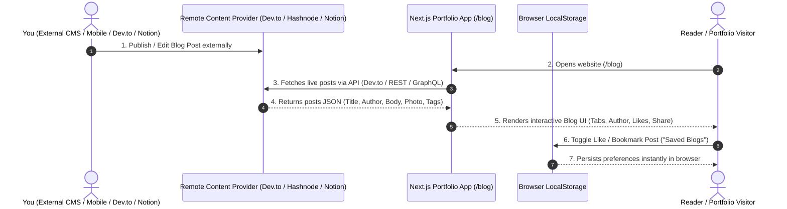

# Harsh Vardhan Prasad - Portfolio & Dynamic Blog Architecture

A modern Next.js portfolio & interactive headless Blog system built with **React 19**, **Next.js App Router**, **Tailwind CSS v4**, and **Framer Motion**.

---

## 🏗️ Blog Architecture & Remote CMS Integration

The blog is designed to be **decoupled, interactive, and remote-first**. You can publish articles from an external platform (e.g., Hashnode, Dev.to, Notion, or Sanity CMS) and have them reflect directly on your website **without opening your codebase or re-deploying manual code changes**.



---

## ⚡ How Remote Blog Publishing Works (Without Opening Website)

You can choose one of the following setups so new posts automatically update on your live site:

### Option A: Dev.to API (Easiest - 100% Free & Zero Config)
1. Write articles on [Dev.to](https://dev.to).
2. The website fetches posts from `https://dev.to/api/articles?username=YOUR_USERNAME`.
3. Every time you hit **Publish** on Dev.to, your website displays the new blog instantly.

### Option B: Hashnode GraphQL API
1. Publish articles on your Hashnode publication.
2. Query Hashnode's GraphQL API (`gql.hashnode.com`) directly in `lib/blogs.ts`.
3. Articles update in real time with rich markdown formatting and syntax highlighting.

### Option C: Notion Database as CMS
1. Create a Notion database with columns (`Title`, `Slug`, `Category`, `Summary`, `PublishedDate`).
2. Add `NOTION_API_KEY` and `NOTION_DATABASE_ID` in `.env.local`.
3. The site fetches articles directly from your Notion workspace.

### Option D: Headless CMS (Sanity.io / Contentful / Hygraph)
1. Set up a free Sanity Studio dashboard.
2. Publish articles using Sanity's visual editor on your phone or browser.
3. Configure Incremental Static Revalidation (ISR) or client fetching in Next.js.

---

## 📂 Blog Component & Folder Hierarchy

```text
portfolio/
├── app/
│   ├── blog/
│   │   ├── page.tsx               # Blog Hub: Search, Category Tabs, Post Grid
│   │   └── [slug]/
│   │       └── page.tsx           # Blog Detail: Article View, Author Box, Likes, Share
│   ├── globals.css                # Custom theme variables & Tailwind v4 styles
│   └── layout.tsx                 # Root layout with ThemeProvider & Lenis Scroll
├── components/
│   ├── blog/
│   │   ├── BlogNavbar.tsx         # Header navigation with search & back button
│   │   ├── CategoryTabs.tsx       # Field category filter tabs (Tech, Web Dev, Saved, etc.)
│   │   ├── BlogCard.tsx           # Post card displaying author photo, likes, save & share
│   │   └── Toast.tsx              # Toast banner notification for copied share links
│   ├── right/
│   │   └── Navbar.tsx             # Main navbar updated with Blog link
│   └── left/
│       └── Cta.tsx                # Sidebar CTA updated with Blog link
├── lib/
│   ├── types/
│   │   └── blog.ts                # TypeScript interfaces (BlogPost, Author, Category)
│   └── blogs.ts                   # Data fetcher layer (Remote API + Fallback Data)
└── README.md                      # Architecture documentation
```

---

## ✨ Features Included

1. **Category Filtering Tabs**: Filter articles by field (`All`, `Tech & AI`, `Web Dev`, `System Design`, `Tutorials`, `Saved`).
2. **Saved Blogs (`localStorage`)**: Click the bookmark icon to save favorite posts locally. Access them anytime under the **Saved** tab.
3. **Author Profile Box**: Every blog card & detail page displays the author's name, photo/avatar, role, and bio.
4. **Interactive Likes Counter**: Readers can click the Heart button to like articles (saved locally per post ID).
5. **Send Link / Link Generator**: Click the Share icon to generate a direct permalink to the blog post, copy it to clipboard, and display a slick confirmation toast.
6. **Search Bar**: Real-time filtering by title, summary, author, or tags.
7. **Dark / Light Theme Sync**: Seamlessly matches your existing portfolio color tokens (`--main`, `--sidebar`, `--surface`, `--accent`).

---

## 🛠️ Getting Started

### 1. Run Development Server
```bash
npm run dev
```

### 2. View Blog Locally
Open `http://localhost:3000/blog` in your browser.

### 3. Connect External CMS (Optional)
To point to your live Dev.to or Hashnode username, update `NEXT_PUBLIC_DEVTO_USERNAME` in `.env.local`:
```env
NEXT_PUBLIC_DEVTO_USERNAME="your_username"
```

---

## 🤖 Future AI & LLM Integrations

For a complete breakdown of futuristic AI & LLM feature updates (RAG Chatbots, AI Article Summarizer, Voice Readers, Semantic Search, Code Explainer), see [AI_FUTURE_ROADMAP.md](file:///Users/harsh/Downloads/portfolio/AI_FUTURE_ROADMAP.md).

